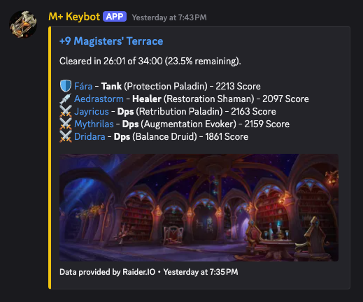

# mplus-keybot

A Discord bot that tracks Mythic+ dungeon runs for your World of Warcraft guild or friend group. Never miss a key completion again—get automatic notifications when followed characters finish dungeons.

<p align="center">
  
</p>

## What It Does

**For guilds and friend groups:**

- Use `/follow` to open a private Battle.net-authenticated character picker
- Follow or unfollow only characters returned by your Battle.net WoW profile
- Get automatic Discord notifications when followed characters complete dungeons

## Features

- **Slash command registration** (`/follow`) for Battle.net-verified character management
- **Automatic polling** of Raider.IO every 5 minutes for runs
- **SQLite storage** for followed characters and run history—no external database needed
- **React Router SSR management UI** orchestrated by .NET Aspire, backed by ASP.NET Core JSON API endpoints
- **Lightweight**—runs anywhere .NET runs

## Quick Start

1. **Create a Discord bot** at [discord.com/developers](https://discord.com/developers) and invite it to your server
2. **Create a Battle.net application** and configure the redirect URI to match `Web:PublicBaseUrl` plus `/api/auth/blizzard/callback`
3. **Copy the example config** and add your Discord and Battle.net credentials:
    ```bash
    cp appsettings.example.json appsettings.json
    # Edit appsettings.json with your Discord token and channel name
    ```
4. **Run it**:
    ```bash
    dotnet run --project src/MPlusKeybot.AppHost
    ```

The bot will create `mplus-data.db` in the working directory.

## Requirements

- [.NET 10 SDK](https://dotnet.microsoft.com/download/dotnet/10.0)
- Node.js/npm for building the React web UI
- Discord bot token (create one at [Discord Developer Portal](https://discord.com/developers/applications))
- Discord channel where the bot can post messages
- Battle.net application credentials with the `wow.profile` scope
- Public HTTPS URL for the follow management web UI

## Configuration

The bot uses standard .NET configuration. You can use `appsettings.json`, environment variables, or command-line arguments.

### Option 1: appsettings.json

Copy the example and edit:

```bash
cp appsettings.example.json appsettings.json
```

```json
{
	"Discord": {
		"Token": "your-bot-token-here",
		"Channel": "mythic-plus"
	},
	"Web": {
		"PublicBaseUrl": "https://example.com/mplus-keybot",
		"PathBase": "/mplus-keybot"
	},
	"Blizzard": {
		"ClientId": "battle-net-client-id",
		"ClientSecret": "battle-net-client-secret",
		"Region": "us"
	}
}
```

`Web:PublicBaseUrl` is used for Discord link buttons, Battle.net redirect URIs, and form redirects. If your reverse proxy forwards `/mplus-keybot` to the app, set `Web:PathBase` to `/mplus-keybot`; if it strips the prefix, leave `Web:PathBase` empty while keeping the public URL prefixed.

> ⚠️ `appsettings.json` is git-ignored to prevent accidentally committing secrets.

### Option 2: Environment Variables

```bash
export Discord__Token=your-bot-token-here
export Discord__Channel=mythic-plus
export Web__PublicBaseUrl=https://localhost:5142/mplus-keybot
export Web__PathBase=/mplus-keybot
export Blizzard__ClientId=battle-net-client-id
export Blizzard__ClientSecret=battle-net-client-secret
export Blizzard__Region=us
dotnet run --project src/MPlusKeybot.AppHost
```

### Option 3: Command Line

```bash
dotnet run --project src/MPlusKeybot.Api/MPlusKeybot.Api.csproj -- --Discord:Token=your-token --Discord:Channel=mythic-plus
```

## Local Battle.net testing without Discord

In development, you can omit `Discord:Token` and use `https://localhost:5173/mplus-keybot/api/dev/follow?discordUserId=dev-user` to create the same short-lived follow flow and complete the real Battle.net sign-in. Configure your Battle.net app with `https://localhost:5173/mplus-keybot/api/auth/blizzard/callback` as the redirect URI. The Discord/dev follow link is one-time use and expires quickly; the resulting management session lasts 24 hours.

The Aspire AppHost pins the local web endpoint to `https://localhost:5173/mplus-keybot` by default so Battle.net redirect URI registration is stable. Override the port with `Web:LocalPort` if needed, or set `AppHost:PublicBaseUrl` explicitly when testing through a tunnel or reverse proxy.

## Local web development

The local topology is Aspire-orchestrated:

```text
Browser -> React Router SSR Node app in src/MPlusKeybot.Web
  /api/** -> thin frontend proxy -> ASP.NET Core API in src/MPlusKeybot.Api
  /**     -> React Router SSR routes
```

Install frontend dependencies once:

```bash
cd src/MPlusKeybot.Web
npm install
```

Then run the AppHost from the repository root and open `https://localhost:5173/mplus-keybot` or the web endpoint shown in the Aspire dashboard:

```bash
dotnet restore
dotnet build
dotnet run --project src/MPlusKeybot.AppHost
```

Browser-side React fetches use same-origin `/api/...` URLs, handled by a generic React Router proxy route. Server-side React Router loaders and the proxy use the `API_BASE_URL` runtime environment variable injected by Aspire.

## Testing

```bash
dotnet test
```

The Playwright character-management e2e tests run when Chromium and the local frontend dependencies are installed:

```bash
dotnet build tests/MPlusKeybot.Tests/MPlusKeybot.Tests.csproj
pwsh tests/MPlusKeybot.Tests/bin/Debug/net10.0/playwright.ps1 install chromium
npm install --prefix src/MPlusKeybot.Web
dotnet test --filter CharacterManagementE2ETests
```

CI runs the same E2E scenarios against the Nix-built API and web packages with
`tests/run-e2e.ts`, rather than the Aspire development server.

## Deployment

### Nix/NixOS (Recommended)

The repository includes a Nix flake for reproducible builds and deployment:

```bash
# Enter development shell
nix develop

# Build the bot
nix build

# Run directly
nix run
```

#### NixOS Module

For production deployments on NixOS, use the provided module:

```nix
{
  inputs.mplus-keybot.url = "github:adampoit/mplus-keybot";

  outputs = { nixpkgs, mplus-keybot, ... }: {
    nixosConfigurations.mplus-bot = nixpkgs.lib.nixosSystem {
      system = "x86_64-linux";
      modules = [
        mplus-keybot.nixosModules.default
        {
          services.mplus-keybot = {
            enable = true;
            environmentFile = "/run/secrets/mplus-keybot.env";
          };
        }
      ];
    };
  };
}
```

Create `/run/secrets/mplus-keybot.env` with:

```text
Discord__Token=your-bot-token-here
Discord__Channel=mythic-plus
Web__PublicBaseUrl=https://example.com/mplus-keybot
Web__PathBase=/mplus-keybot
Blizzard__ClientId=battle-net-client-id
Blizzard__ClientSecret=battle-net-client-secret
Blizzard__Region=us
```

After updating NuGet dependencies, regenerate the lock file:

```bash
nix run .#fetch-deps -- ./nix/nuget-deps.json
```

### Standalone Binary (Linux)

You can also build a self-contained binary:

```bash
dotnet publish -c Release -r linux-x64 \
  --self-contained=true \
  -p:PublishSingleFile=true \
  -p:GenerateRuntimeConfigurationFiles=true \
  -o ./artifacts

# Run on target server
./artifacts/mplus-keybot
```

## License

MIT
